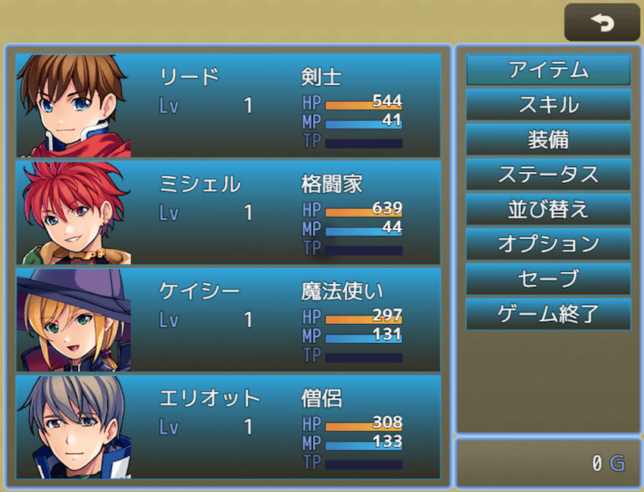
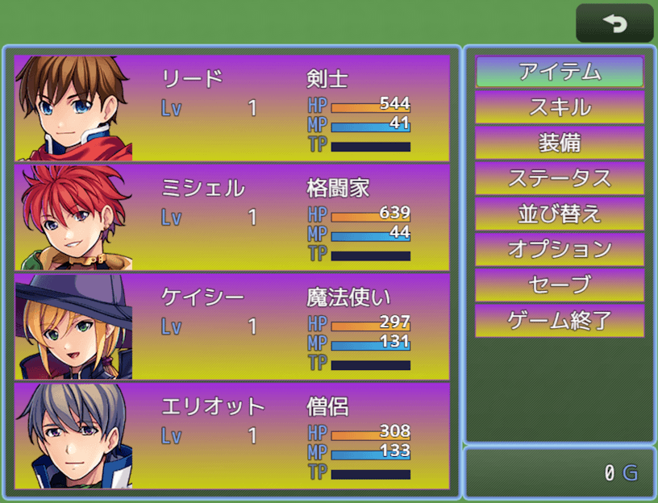
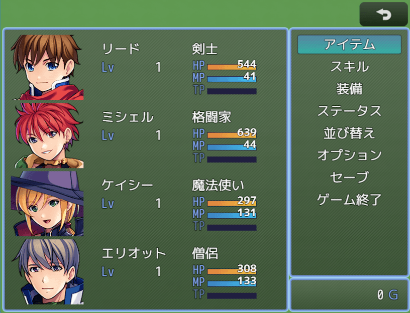

# 選択項目の背景色プラグイン（NLM_BackSpriteColor.js）
### RPGツクールMZ専用プラグイン

MZ特有の選択項目ごとの黒い背景スプライト色（itemBackColor）を自由な色に変更します

背景色1（上側）と背景色2（下側）のグラデーション表示となります

背景スプライト自体を消去したい場合は、1と2の両方の「Alpha」を「0」に設定して下さい

# download

プラグインの download は、[右クリック「名前を付けてリンク先を保存」](https://raw.githubusercontent.com/nolimits-tukool/NLM_BackSpriteColor/refs/heads/main/NLM_BackSpriteColor.js)  
RPGツクールMZ専用です

# license

　MITライセンスの通りです

## [リポジトリ 一覧へ](https://github.com/nolimits-tukool?tab=repositories)
